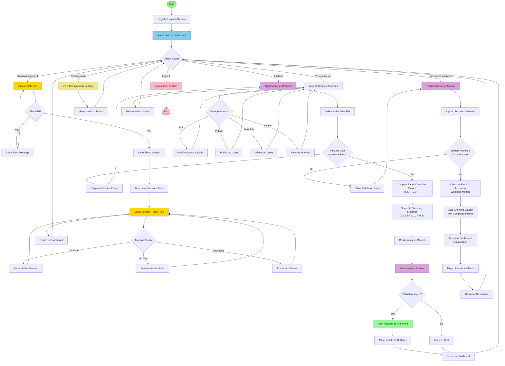
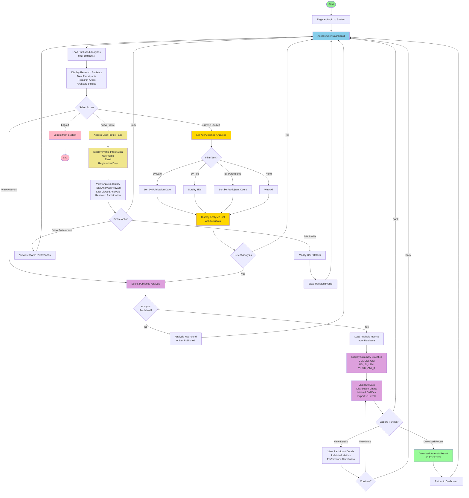

# Cognitive & Emotional Performance System - Methodology Flowcharts

This document contains comprehensive flowchart diagrams for the Admin and User methodologies used in the system. These flowcharts can be used in research projects, dissertations, and technical documentation.

---

## 1. Admin Methodology Flowchart

The Admin flowchart illustrates the complete workflow for administrators managing data, creating analyses, and publishing results for users.

### Admin Workflow Components:

**A. Authentication**
- Register/Login to System
- Access Admin Dashboard

**B. Data Management**
- Upload Data Files
- Validate File Format
- Save File to System
- Deactivate Previous Files
- Data Manager Interface
  - Activate Dataset
  - Archive Files
  - Download Dataset

**C. Analysis Creation (Paper-Compliant)**
- Quick Analysis Creation
- Select Active Data File
- Validate Data Against Schema
- Compute Metrics:
  - TI (Technical Index)
  - NTI (Non-Technical Index)
  - CMI_P (Comprehensive Metrics Index)
- Generate Summary Statistics:
  - CUI (Cognitive Understanding Index)
  - CDI (Cognitive Debugging Index)
  - CCI (Cognitive Completion Index)
  - PSI (Problem Solving Index)
  - EI (Emotion Index)
  - LTMI (Learning Technical Metrics Index)
- Create Analysis Record
- View Analysis Results

**D. Analysis Publishing**
- Decide to Publish/Draft
- Mark Analysis as Published
- Make Visible to All Users
- Keep as Draft

**E. Advanced Analysis (Bloom's Taxonomy)**
- Technical Analysis Upload
- Upload Technical Dataset
- Validate Technical Data Structure
- Compute Bloom's Taxonomy Weighted Metrics
- Save Enriched Dataset
- Technical Dashboard Visualization
- Export Results & Charts

**F. Analysis Management**
- View All Created Analyses
- Edit Analysis Details
- Publish/Unpublish
- Delete Analysis

**G. System Configuration**
- View Configuration Settings
- Adjust System Parameters

### Admin Flowchart (Mermaid Code):

---

## 2. User Methodology Flowchart

The User flowchart illustrates how users access, view, and interact with published analyses and research data.

### User Workflow Components:

**A. Authentication**
- Register/Login to System
- Access User Dashboard

**B. Dashboard Navigation**
- Load Published Analyses from Database
- Display Research Statistics:
  - Total Participants
  - Research Areas
  - Available Studies

**C. View Analysis**
- Select Published Analysis
- Validate Access Permissions
- Load Analysis Metrics from Database
- Display Summary Statistics:
  - CUI, CDI, CCI
  - PSI, EI, LTMI
  - TI, NTI, CMI_P
- Visualize Data:
  - Distribution Charts
  - Mean & Standard Deviation
  - Expertise Levels
- Explore Detailed Data:
  - View Participant Details
  - Individual Metrics
  - Performance Distribution
- Download Report (PDF/Excel)

**D. User Profile**
- Access User Profile Page
- View Profile Information:
  - Username
  - Email
  - Registration Date
- View Analysis History:
  - Total Analyses Viewed
  - Last Viewed Analysis
  - Research Participation
- Profile Actions:
  - Edit Profile
  - View Research Preferences
  - Save Changes

**E. Browse Studies**
- List All Published Analyses
- Filter/Sort Options:
  - By Publication Date
  - By Title
  - By Participant Count
- Display Analyses List with Metadata
- Select Analysis for Viewing

**F. Exit**
- Logout from System

### User Flowchart (Mermaid Code):

---

## How to Use These Flowcharts in Your Research Project

### Option 1: Embed in Research Paper (Markdown)
Copy the Mermaid code directly into your markdown or LaTeX document.

### Option 2: Export as Images
Use online Mermaid editors to export as PNG/SVG:
- Visit: https://mermaid.live
- Paste the flowchart code
- Download as image

### Option 3: Use in Presentation
Include the flowcharts in PowerPoint, Google Slides, or other presentations by exporting to image format.

### Option 4: Reference in Documentation
Include the code in technical documentation, GitHub wikis, or online documentation platforms that support Mermaid.

---

## Color Legend

- **Green** (`#90EE90`): Start/End Points
- **Light Blue** (`#87CEEB`): Main Dashboard/Entry Points
- **Gold** (`#FFD700`): Data Management Functions
- **Plum** (`#DDA0DD`): Analysis Functions
- **Light Green** (`#98FB98`): Critical Actions (Publish/Export)
- **Khaki** (`#F0E68C`): User Profile & Configuration
- **Pink** (`#FFB6C6`): Logout/End Actions

---

## Metrics Explained

### Cognitive Indices
- **CUI** - Cognitive Understanding Index
- **CDI** - Cognitive Debugging Index
- **CCI** - Cognitive Completion Index
- **PSI** - Problem Solving Index
- **EI** - Emotion Index
- **LTMI** - Learning Technical Metrics Index

### Paper-Compliant Metrics
- **TI** - Technical Index
- **NTI** - Non-Technical Index
- **CMI_P** - Comprehensive Metrics Index (Paper)

### Bloom's Taxonomy Indices
- **T1** - Knowledge/Understanding (Level 1)
- **T2** - Application/Analysis (Level 2)
- **T3** - Synthesis/Evaluation (Level 3)
- **CL1** - Cognitive Load Index 1
- **CL1_Div3_Scaled** - Scaled Cognitive Load Metric

---

## Document Information

- **System**: Cognitive & Emotional Performance Research Dashboard
- **Created**: February 2026
- **Purpose**: Research Project Documentation
- **Format**: Mermaid Flowcharts (Markdown)
- **Version**: 1.0

---

## Notes for Research Inclusion

1. These flowcharts represent the actual implementation methodology of the system
2. Different user roles (Admin vs Regular User) have distinct workflows
3. The system implements paper-compliant metrics for cognitive research
4. Data validation and error handling are integral parts of the workflow
5. The system supports multiple analysis types with different computational approaches

---

*This document can be included in your research project, thesis, dissertation, or technical documentation. Feel free to customize the flowcharts to match your specific requirements.*
